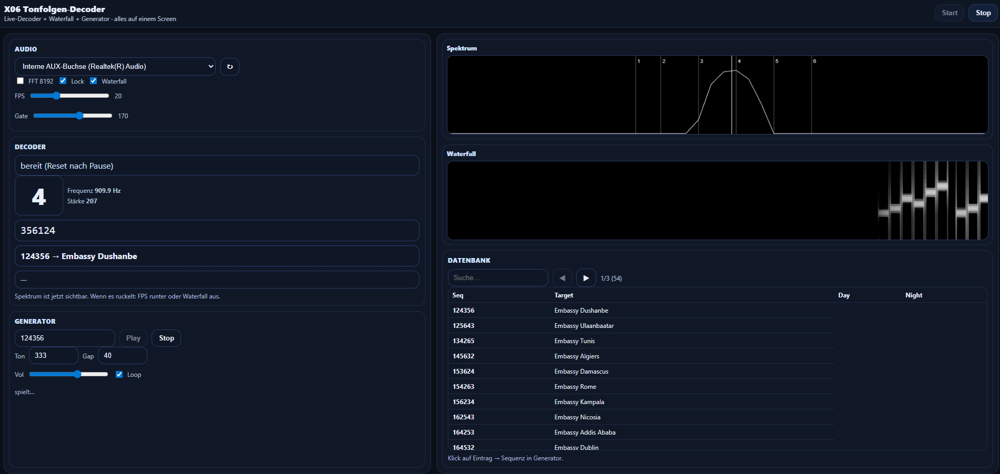

# X06 Tone Sequence Decoder (Web)


Browser-based real-time decoder for 6-tone sequences (1–6) with live spectrum and waterfall visualization, microphone input, integrated day/night station database, and test signal generator.  
The project runs entirely in the browser using the Web Audio API and is suitable for GitHub Pages.



## Live Demo (GitHub Pages)

https://jan-niklas-schneider.github.io/x06-decoder/

---

## Features

### Audio & Decoder
- Selectable audio input (microphone, audio interface, virtual audio cable)
- Live decoding of 6-tone sequences (digits 1–6)
- Robust FFT-based detection with window scoring
- Frequency-to-digit mapping
- Display of detected digit, frequency, signal strength, and current sequence

### Visualization
- Live frequency spectrum with labeled frequency axis (Hz)
- Markers for all reference frequencies (1–6)
- Marker for currently detected frequency
- Waterfall plot (spectrogram) showing tone sequences over time

### Test Signal Generator
- Playback of arbitrary sequences (e.g. 123456)
- Adjustable tone length, gap, and volume
- Loop mode for continuous testing
- Useful for offline development and calibration

---

## Usage

1. Open the GitHub Pages URL in a modern browser (Chrome or Edge recommended).
2. Select an audio input device and click **Start**.
3. Allow microphone access if prompted.
4. Play or inject a 6-tone sequence.
5. After six digits are detected, the sequence is resolved automatically against the station database.

---

## User Interface – Controls and Indicators

### Audio & Control Panel

| Control | Type | Description |
|--------|------|-------------|
| Input | Dropdown | Selects the audio input device. |
| Refresh | Button | Reloads available audio devices. |
| Start | Button | Starts audio capture and decoding. |
| Stop | Button | Stops audio capture and decoding. |
| FFT 8192 | Checkbox | Toggles FFT size (4096 / 8192). |
| Lock | Checkbox | Requires stable detection before committing a digit. |
| Waterfall | Checkbox | Enables/disables waterfall plot. |
| FPS | Slider | Limits plot update rate. |
| Gate | Slider | Minimum signal level for valid detection. |

### Decoder Status

| Field | Description |
|------|-------------|
| Status | Current decoder state. |
| Digit | Currently detected digit (1–6). |
| Frequency | Detected peak frequency (Hz). |
| Strength | FFT magnitude (0–255). |
| Sequence Buffer | Digits collected so far. |
| Result | Resolved target or unknown sequence. |

### Test Signal Generator

| Control | Type | Description |
|--------|------|-------------|
| Sequence | Input | 6-digit test sequence (1–6). |
| Play | Button | Starts sequence playback. |
| Stop | Button | Stops playback. |
| Tone (ms) | Input | Tone duration in milliseconds. |
| Gap (ms) | Input | Pause between tones. |
| Volume | Slider | Generator output level. |
| Loop | Checkbox | Repeats the sequence. |

### Plots

| Plot | Description |
|------|-------------|
| Spectrum | Live FFT frequency spectrum. |
| Waterfall | Time-based spectrogram. |

### Station Database

| Element | Description |
|--------|-------------|
| Search | Filters stations by sequence or target. |
| Paging | Navigate through database pages. |
| Table | Displays station entries; detected sequences are highlighted. |

---

## Local Development

```bash
git clone https://github.com/jan-niklas-schneider/x06-decoder.git
cd x06-decoder
python -m http.server 8000
```

Then open:

http://localhost:8000

---

## Notes

- Disable echo cancellation, noise suppression, and automatic gain control.
- Use a quiet environment.
- Direct audio injection is more reliable than speaker-to-microphone coupling.

---

## Data License

The station database used in this project is derived from publicly available
information provided by priyom.org and is licensed under the
Creative Commons Attribution-NonCommercial-ShareAlike 4.0 International License.

https://priyom.org/diplomatic-stations/russia/x06

## License

MIT License.
